## Scripts and figures accompanying _Diverse Primary and Secondary Structural Features Are Associated With Y Complex-Dependent mRNA Maturation in Bacillus subtilis_

Below you will find detailed instructions for recreating each figure/means of analysis presented in the paper. If you have questions that are beyond the scope of the paper or this repository [e.g. technical questions like "What shell commands and scripts would I need to run to grab sequence windows for all 21 sites?"] please contact me. 

Please note that all figures used in the paper can also be found under figures/. 

### Figure 1
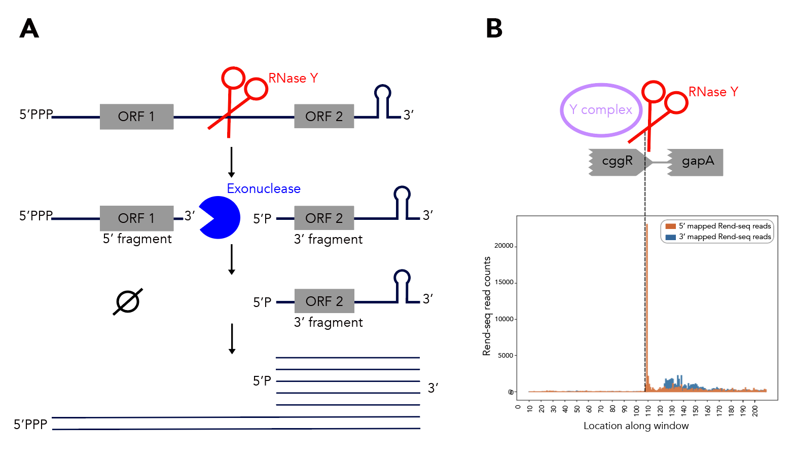

Should you want rend-seq visualizations of the 200nt windows I've been using, look no further than rend\_seq/. I've included the following wigs [all libraries prepared from cells in LB exponential]: 
* WT _B. subtilis_ 168 ["wt\*"]
* ∆RNase J1 168 ["rnj\*"]
* 168 treated with a 5' exonuclease to identify 5' monophosphates [to determine if a 5' end is an alternative isoform or the product of cleavage] ["5exo\*"]
* ∆PNPase 168 [to identify 3' peaks that may result from cleavage] ["pnpA\*"]
* ∆RNase Y 168 ["rny\*"]
* ∆_ylbF_ 168 ["ylbF\*"]

Add the appropriate 5'f/r and 3'f/r wigs into plot\_rend\_seq.py [currently can only plot one set of 5'/3/ files but it's a really easy fix to modify if needed] and run!
If you want to visualize a different set of windows, just use a different bedfile as input--21\_cleavage\_final.bed12 contains all 21 windows that I use for analysis. 
You can verify these sequences in Mochiview if you'd like--go to mochiview/subtilis\_mochiview. There are wigs for [all using derivatives of _B. subtilis_ strain 168 in LB exponential] wt, ∆RNase Y, ∆_ylbF_, ∆_yaaT_ and ∆_ymcA_. You can use Mochiview's find function to search for the 200nt windows, i.e. 21\_cleavage\_final.txt. 

### Figure 3
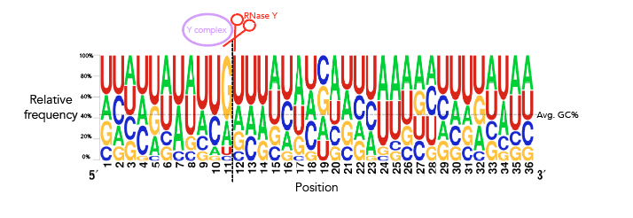

Use sequences/rna\_21\_cleavage\_for\_seqlogo.txt [This is a fasta-format file containing RNA sequences of all 21 windows used. I've shortened my windows from the original ~200nt for visualization purposes so each window contains 25nt after the cleavage site. Since not all windows contain 25nt before the cleavage site I've standardized the length of all windows to be that of the shortest window, meaning that there are 12nt before the cleavage site. Please see methods if the rationale behind this is confusing. All cleavage sites occur between one-indexed nucleotides 11 and 12] as an input to [weblogo](https://weblogo.berkeley.edu/logo.cgi), making sure to click the "Frequency Plot" option. You can view the full 112nt window used for frequency plot analysis using rna\_shortened\_21\_cleavage\_final.txt. 

### Figure 4
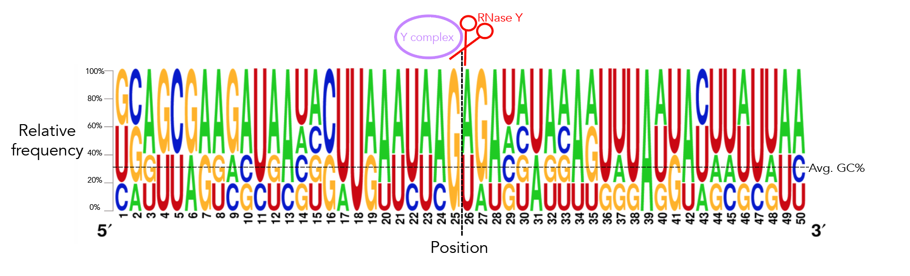

Use staph/staph\_rny\_sites.txt as input into [weblogo](https://weblogo.berkeley.edu/logo.cgi), making sure to click the "Frequency Plot" option. 

### Figure S7
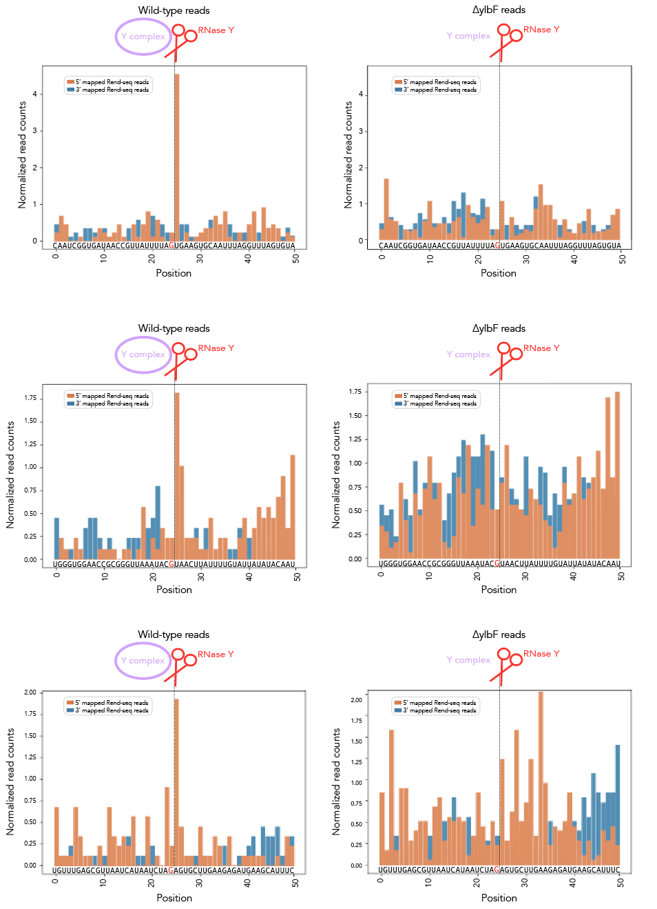
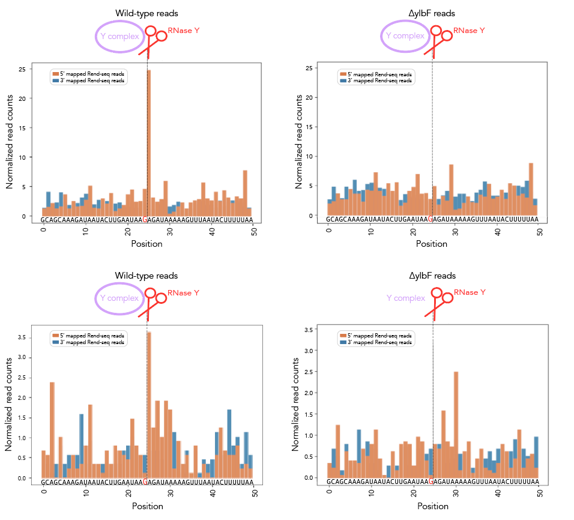

Run staph/values\_from\_rend\_seq\_staph.py. I'm only plotting the 5 seemingly Y complex-dependent sites. The sixth one corresponds to the sequence TACTTACTAAATTTTATTTAACCTAAAAATGAACCACCTGGATGTGTGGG and doesn't seem to be Y complex-dependent. The locations of all staph cleavage sites from [this paper](https://www.ncbi.nlm.nih.gov/pmc/articles/PMC4608709/) can be found in staph/staph\_rny\_sites.txt. The wig files under staph/ need slight modification to run in mochiview. If this is your goal, go to mochiview/staph\_mochiview/. There you can find wt and ∆rny data for our staph strain [wt files are under wt\* and ∆ylbF are under ylbF\*]. We map reads to the [NC\_007795 genome](https://www.ncbi.nlm.nih.gov/nuccore/NC_007795.1). You can grab the NC\_007795 cds from the NCBI site [here](https://www.ncbi.nlm.nih.gov/genome/proteins/154?genome_assembly_id=299272). This requires some modification to be converted to the Mochiview format, so you can use staph\_mochiview/convert\_mochiview\_location.py to do the conversion for you. Or you can just use the already-converted CDS I have, namely NC\_007795\_mochi\_cds.txt. The one benefit of using the script is that it should work for any CDS that needs conversion from NCBI-\>Mochiview, not just NC\_007795. 

### Figures 5 and 14
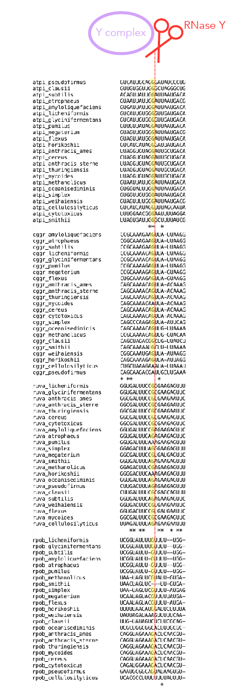

I use [Clustalw2](http://www.clustal.org/omega/#Download) in shell to run all my MSAs. Under msa\_for\_paper I have directories for each cleavage site producing a MSA with alignment-to-subtilis score \>30. I've included alignments for all other sites for which I found sufficient homologs to construct a MSA under msa\_for\_paper/msas\_with\_bad\_scores. All genomes are available under genome\_fasta\_files/ [this also has a file for the staph genome]. I first grab sequences from my fasta files [atpi\_correct\_evolutionary.txt], standardize the length of all sequences to be that of the shortest sequences [equal\_size\_sequences\_seqlogo.py] and convert all T's to U's [dna\_to\_rna\_sequences.py]. From there I run the MSA on my equal-length RNA sequences [rna\_atpi\_correct\_evolutionary.txt] using the slow/accurate option. If you want to further shorten sequences to visualize their sequence logos I've included shorten\_for\_seqlogo.py--this produces 50nt windows that you can use in weblogo. That's really more for fun, though. Those sequence logos don't really tell you much. 
Unfortunately there's no way to denote the cleavage site in the MSA itself so you have to search for it manually. 

If you want to recalculate the alignment-to-subtilis scores, take the average of all pairwise alignment scores of the form "Sequences (1:n) Aligned. Score: " [as seen above]. Note that ClustalW2 will output these scores _prior_ to producing the MSA, so be on the lookout. Sequence 1 in all \*\_evolutionary.txt files is always the _subtilis_ sequence. This was easy enough to do manually that I didn't bother automating it. 

### Figures 6, S8, S9, S10 and S11

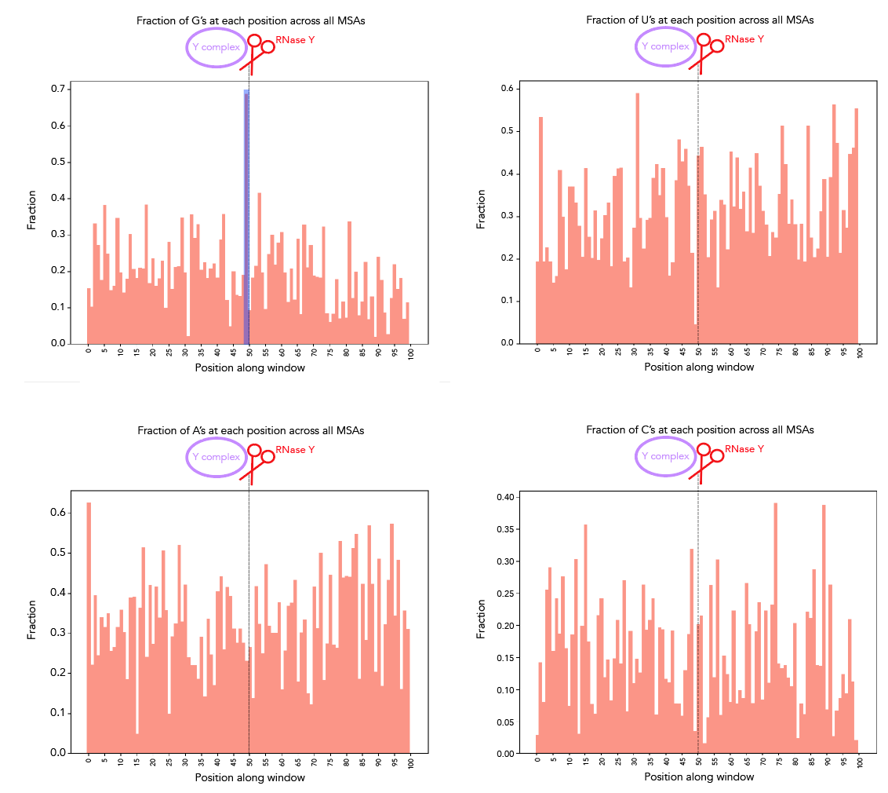

Shortened MSA snippets around the cleavage site [50nt either side] are under msa\_for\_paper/msa\_nucleotide\_enrichment/\*.txt. sequences\_for\_analysis.txt contains all 8 MSAs, whereas the other \*.txt files are for individual MSAs. You can check for enrichment of A/U/C/G by running plots\_of\_sequences.py and adding the appropriate file as input. I didn't find looking at individual MSAs to be particularly illuminating but I've included them in here regardless. 

### Figure 7

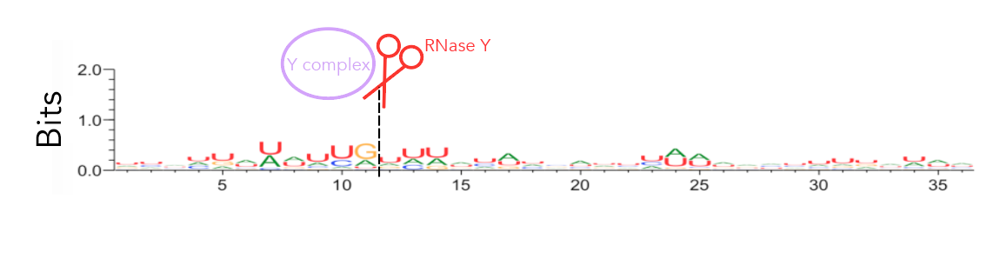

I ran weblogo in shell for this--the input file is seqlogo/rna\_21\_cleavage\_for\_seqlogo.txt. The output file is seqlogo/sequence\_logo.eps. The seqlogo directory also has other files that can be used as input--rna\*.txt files have AUCG sequences whereas others have ATCG. To produce rna\_21\_cleavage\_for\_seqlogo.txt I took 21\_cleavage\_final.txt, ran equal\_size\_sequences\_seqlogo.py to standardize the length of all input sequences to be that of the shortest sequences and then ran shorten\_for\_seqlogo.py to get at most a 50nt window. I realize that equal\_size\_sequences\_seqlogo.py and shorten\_for\_seqlogo.py are somewhat redundant scripts. shorten\_for\_seqlogo.py will honestly get the job done if you're ok hard-coding window sizes. 

### Figure 8

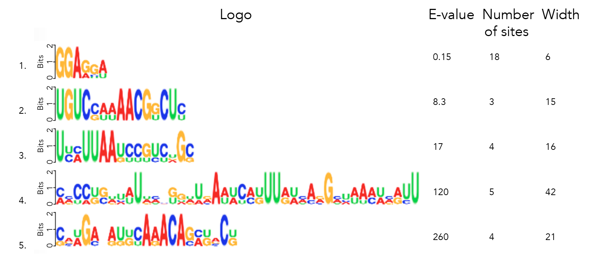

I ran [MEME](http://meme-suite.org/tools/meme) on 21\_cleavage\_final.txt to find the top 5 motifs with a minimum motif width of 3nt and max width of 50nt. Running the search with both a 0-order and 1st-order background yields the same results. 

### Kmer analysis

For this I ran kmer\_analysis/kmer\_distribution.py. This prints out a list of all kmers in ascending order of p value. For each kmer I also note the number of times it appeared in the 21 sites. 

### Figure 9

MFE, MEA, centroid and pairing probability-constrained structures are generated via RNAfold and visualized in VARNA. Consensus and locaRNA structures are also visualized in VARNA but generated separately.

If your RNAfold command isn't working, check that any "--" has actually translated properly to shell. Sometimes I found that -- was replaced with an emdash, which threw things off.

#### MFE

If you want to regenerate the structures, go to mfe/ and run rnafold --noPS --infile=21\_cleavage\_final.txt --outfile=21\_cleavage\_mfe.txt. From here, run mfe/separate\_by\_fasta\_header.py to separate each structure into its own fasta-format file. You'll need to do this to visualize in varna. Otherwise you can just use \*\_mfe.txt under mfe/. 

Then, you're going to want to run paired\_prob/colormap\_from\_dat.py to get varna-compatible pairing probability colormaps for each site. Let's say you're interested in atpI--copy the numbers under "atpi reads:"

From here, go to mfe/ and run the following: java -cp path/to/VARNAv3-93.jar fr.orsay.lri.varna.applications.VARNAcmd -i atpi\_mfe.txt -colorMapStyle "0.00:#0000FF,0.50:#FFFFFF,1.00:#FF0000" -colorMap [paste the colormap from colormap\_from\_dat here, leave a space between it and -colorMap].  

#### MEA

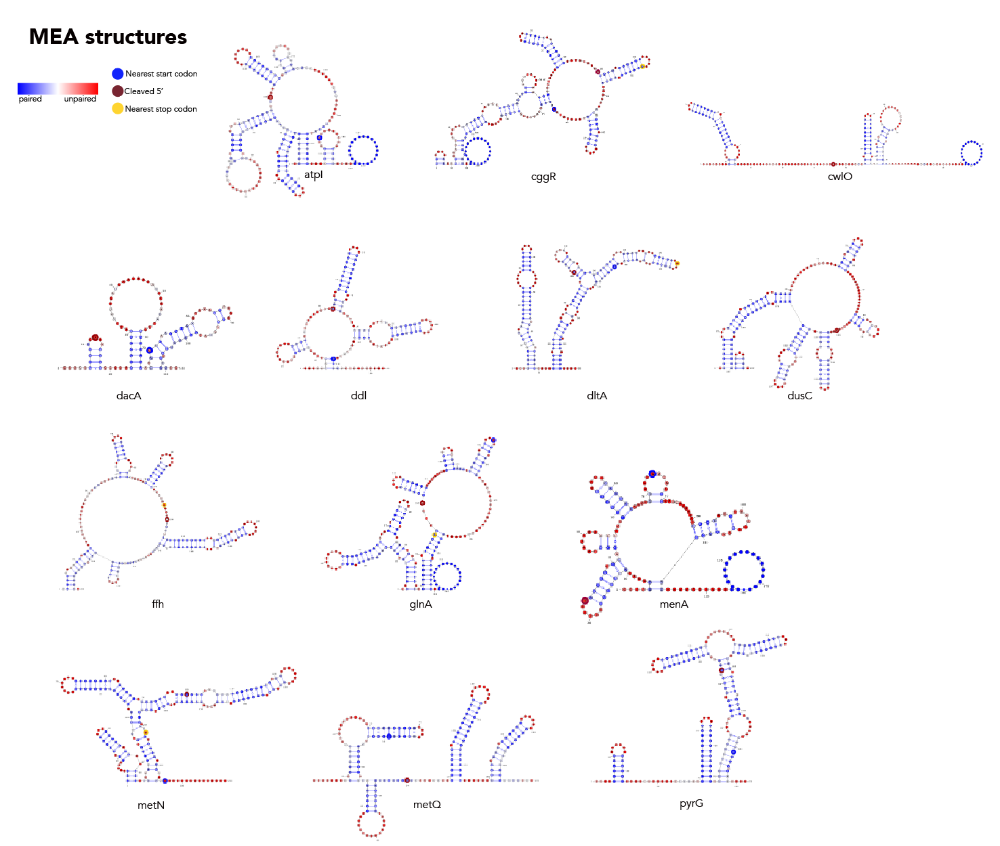

If you want to regenerate the structures, go to mea/ and run rnafold --noPS --MEA --infile=21\_cleavage\_final.txt --outfile=21\_cleavage\_mea.txt. From here, run mea/separate\_by\_fasta\_header.py to separate each structure into its own fasta-format file. Note that RNAfold prints out multiple structures given the MEA option. The first structure is the MFE and, unfortunately, if you pass a file with multiple structures to VARNA, it'll only print the first one. The last structure the --MEA option produces is the actual MEA structure. As such you'll need to delete any preceding structures to get a correct visualization. 

Then, you're going to want to run paired\_prob/colormap\_from\_dat.py to get varna-compatible pairing probability colormaps for each site. Let's say you're interested in atpI--copy the numbers under "atpi reads:"

From here, go to mea/ and run the following: java -cp path/to/VARNAv3-93.jar fr.orsay.lri.varna.applications.VARNAcmd -i atpi\_mea.txt -colorMapStyle "0.00:#0000FF,0.50:#FFFFFF,1.00:#FF0000" -colorMap [paste the colormap from colormap\_from\_dat here, leave a space between it and -colorMap].  

#### Centroid

If you want to regenerate the structures, go to centroid/ and run rnafold --noPS -p --infile=21\_cleavage\_final.txt --outfile=21\_cleavage\_centroid.txt. From here, run mea/separate\_by\_fasta\_header.py to separate each structure into its own fasta-format file. Note that RNAfold prints out multiple structures given the centroid option. The first structure is the MFE and, unfortunately, if you pass a file with multiple structures to VARNA, it'll only print the first one. The last structure the -p option produces is the actual centroid structure. As such you'll need to delete any preceding structures to get a correct visualization.
Additionally, you need to get rid of the expression in curly braces after the structure. For some reason not doing so makes VARNA crash.

Then, you're going to want to run paired\_prob/colormap\_from\_dat.py to get varna-compatible pairing probability colormaps for each site. Let's say you're interested in atpI--copy the numbers under "atpi reads:"

From here, go to centroid/ and run the following: java -cp path/to/VARNAv3-93.jar fr.orsay.lri.varna.applications.VARNAcmd -i atpi\_centroid.txt -colorMapStyle "0.00:#0000FF,0.50:#FFFFFF,1.00:#FF0000" -colorMap [paste the colormap from colormap\_from\_dat here, leave a space between it and -colorMap].  

#### Pairing probability-constrained

This is a bit more complicated. 

1. paired\_prob/separate\_by\_fasta\_header.py on 21\_cleavage\_final.txt 
2. [again using atpI as the example] feed atpi.txt into paired\_prob/produce\_constraints.py to produce atpi\_correct\_constrained.txt
3. in paired\_prob run rnafold --noPS -p0 -C --infile=atpi\_constrained.txt --outfile=atpi\_constrained\_structures.txt to get the constrained kTln(Z) values
4. in paired\_prob run rnafold --noPS -p0 --infile=atpi.txt --outfile=atpi\_partition.txt to get the kTln(Z) value for the unconstrained structure
5. feed "atpi" into paired\_prob/boltzmann.py in the "name" field and run. This give you the .dat file atpi\_paired\_probs.dat.
6. in paired\_prob run rnafold --noPS --shape=atpi\_paired\_probs.dat --infile=atpi.txt --outfile=atpi\_paired.txt

Then, you're going to want to run paired\_prob/colormap\_from\_dat.py to get varna-compatible pairing probability colormaps for each site. Let's say you're interested in atpI--copy the numbers under "atpi reads:"

From here, stay in paired\_prob and run the following: java -cp path/to/VARNAv3-93.jar fr.orsay.lri.varna.applications.VARNAcmd -i atpi\_paired.txt -colorMapStyle "0.00:#0000FF,0.50:#FFFFFF,1.00:#FF0000" -colorMap [paste the colormap from colormap\_from\_dat here, leave a space between it and -colorMap].  

#### Consensus

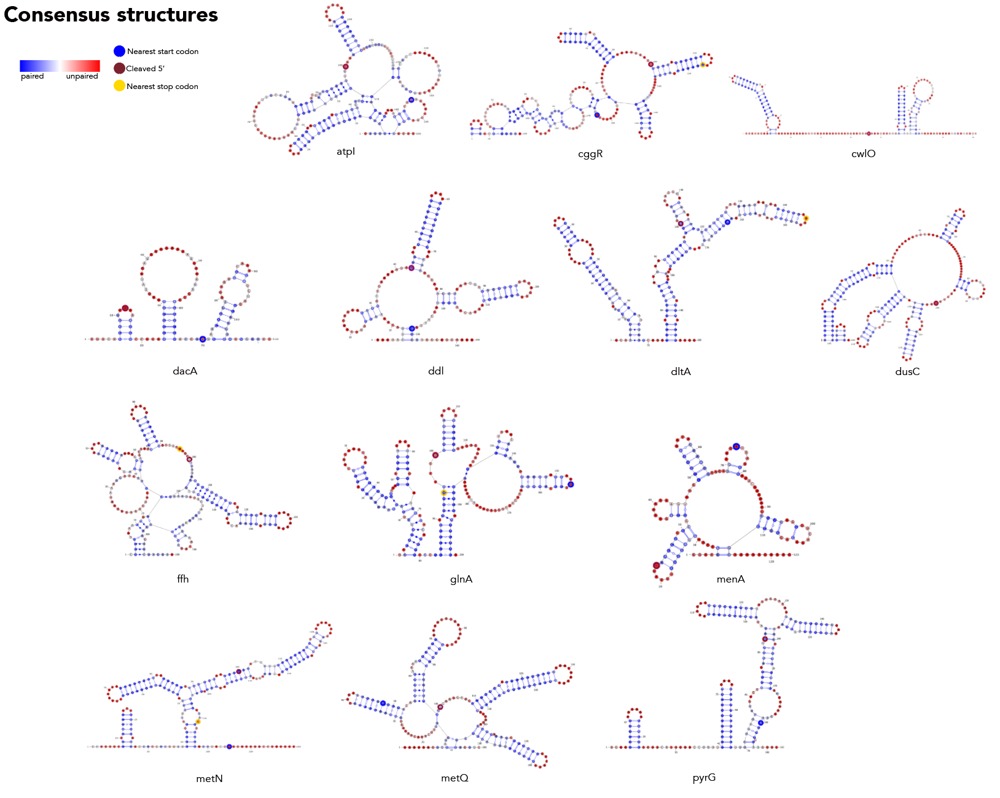
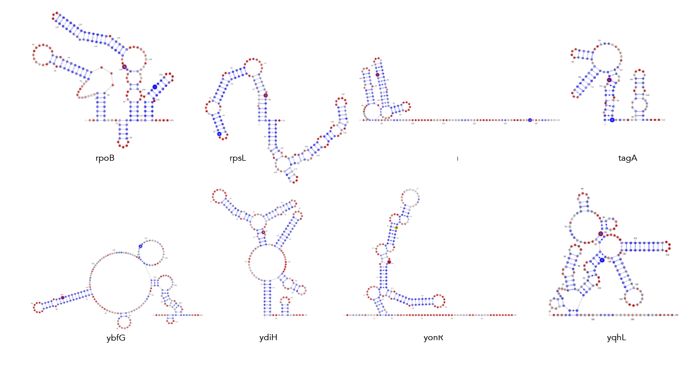

Create the file consensus/atpi\_structures.txt. Comments in the file must start with a # --these lines will be ignored. Separate each structure with a new line--e.g. #MFE \n [mfe structure]\n #MEA \n [mea structure]. Each \*\_structures.txt file must contain a MFE, MEA, centroid and pairing probability-constrained structure in no order. Just keep the dot-bracket structures, don't add anything else in. You don't need to add sequences to this file. 

Use atpi\_structures as input into consensus/consensus.py in addition to consensus/rna\_atpi.txt--this outputs atpi\_consensus.txt. You need the rna version because, while RNAfold will automatically convert T-\>U when generating a structure from a given sequence, the consensus approach does not. We don't want T's in varna structures so you need to take this step.

Then, you're going to want to run paired\_prob/colormap\_from\_dat.py to get varna-compatible pairing probability colormaps for each site. Let's say you're interested in atpI--copy the numbers under "atpi reads:"

From here, move to consensus/ and run the following: java -cp path/to/VARNAv3-93.jar fr.orsay.lri.varna.applications.VARNAcmd -i atpi\_consensus.txt -colorMapStyle "0.00:#0000FF,0.50:#FFFFFF,1.00:#FF0000" -colorMap [paste the colormap from colormap\_from\_dat here, leave a space between it and -colorMap].  

#### locaRNA

Feed 21\_cleavage\_final.txt into [locaRNA](http://rna.informatik.uni-freiburg.de/LocARNA/Input.jsp). From here copy the resulting consensus structure along with the subtilis sequence into a text file in locarna/. It's important that you copy the sequence and structure exactly as presented, dashes and all! From here input that sequence and structure into locarna/consensus\_seq\_structure.py to remove the dashes and get the consensus structure elements that correspond to the subtilis sequence. 

Then, you're going to want to run paired\_prob/colormap\_from\_dat.py to get varna-compatible pairing probability colormaps for each site. Let's say you're interested in atpI--copy the numbers under "atpi reads:"

From here, go to locarna/ and run the following: java -cp path/to/VARNAv3-93.jar fr.orsay.lri.varna.applications.VARNAcmd -i atpi\_locarna.txt -colorMapStyle "0.00:#0000FF,0.50:#FFFFFF,1.00:#FF0000" -colorMap [paste the colormap from colormap\_from\_dat here, leave a space between it and -colorMap].  

### Figure 10

Run paired\_prob/paired\_prob\_analysis.py. 

### Figure 11

For all folds [MFE, MEA, centroid, pairing probability-constrained, consensus], navigate to their respective directories and run nearest\_hairpin.py. You can also do this for locaRNA but doing so isn't particularly informative. 

### Figure 13

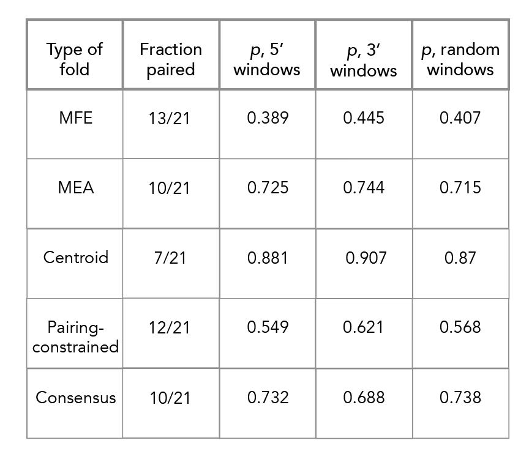

Navigate to p\_value\_analysis/. Each subdirectory corresponds to a different fold [locaRNA not included]. In each directory run select\_21.py--this will produce the requisite p values. Change the input file names [\*\_3prime.txt, \*\_5prime.txt or \*\_random.txt] to determine p values for each background set. These scripts may take some time. Additional details available upon request. 
